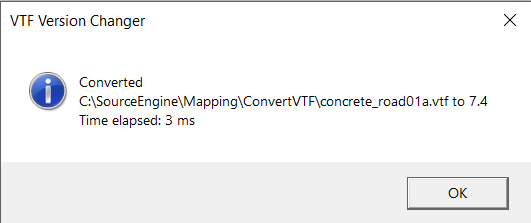

# VTF-Version-Changer-7.5-to-7.4

A clean GUI tool to transform VTF 7.5 to 7.4. Useful when porting maps from newer Source Engine game (CS:GO) to games that only support VTF up to 7.4 (CS:S, HL2,..).

This tool use the VTF conversion function from [antim0118's VTF Version Changer](https://github.com/antim0118/VTF-Version-Changer-7.5-to-7.4).

Credits to them for that.

The improvements of this tool over the other existing converters are the following :

- The user has few options available : Recursive, Extra logs, Automatically stop on unexpected error
- All error during the conversion are caught, so the app will not crash in case of dealing with a corrupted VTF
- The user can cancel the conversion at any time
- The conversion run asynchronous, so the tool will not freeze up while it's executing
- Better Folder Browser
- Drag Drop support

## Download

[VTFVersionChanger v1.0](https://github.com/Moltard/BspZipGUI/releases/latest)

## How to use - Folder Conversion

Select the folder to convert.

Check **Folder and Subfolders** to recursively convert the VTF in the folder and its subfolders.

Check **Verbose** to get more information in the conversion logs (every single file will be logged).

Check **Stop Conversion on Error** if you want the conversion of all files to stop in case an error happen.

Press **Convert VTFs**.

A small confirmation window appear with the amount of VTF files found in the folder (and subfolders). 
Pressing Yes will proceed with the conversion.

## Execution & Logs

In the log section, there is a loading bar, that show the progress of the conversion.

If you want to stop the conversion before the end, you can press the Cancel button.

If an unexpected error happened during the conversion of one file (and you have **Stop Conversion on Error** checked), the conversion will end and the error will be logged.

## How to use - File Conversion

Select the VTF to convert.

Press **Convert VTF.**

The result of the conversion will be displayed in a small window.

A warning message will be displayed if the VTF couldn't be converted because it is not 7.5 or the file is not a real VTF.

An error message will be displayed if an unexpected error happened during the conversion.

### Developers

- [Moltard](https://github.com/Moltard)

